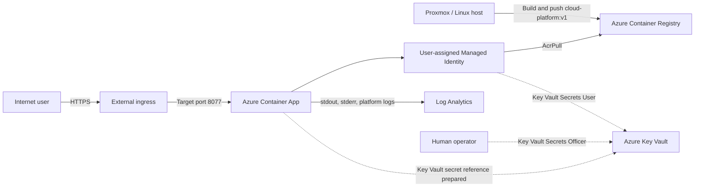

# Azure Secure Container Platform — V1

Build, package, and securely deploy a small Python API from a Proxmox/Linux homelab into Azure Container Apps.

> **V1 status:** Complete for the application, Docker, private registry, managed-identity image pull, public HTTPS deployment, centralized logging, and Key Vault preparation. Reading the Key Vault-backed `APP_MESSAGE` inside the Python application is intentionally reserved for V2.

## Project goal

A development team needs to run a lightweight web application in Azure without managing a virtual machine. The container image must remain private, Azure must pull it without stored registry credentials, the service must be observable, and the design must be ready to consume centrally managed secrets.

This project demonstrates the first working version of that platform:

```text
Write the app
    ↓
Build and test it on Proxmox/Linux
    ↓
Store the image in Azure Container Registry
    ↓
Let Azure Container Apps pull it with Managed Identity
    ↓
Expose it through a public HTTPS endpoint
    ↓
Send platform and container logs to Log Analytics
    ↓
Prepare a Key Vault-backed application setting for V2
```

## What V1 proved

- The application builds and runs outside Azure before cloud deployment begins.
- The same versioned container image can move from a homelab server to Azure.
- A private Azure Container Registry can store the deployable artifact.
- Azure Container Apps can pull the private image with a user-assigned managed identity and `AcrPull` instead of a registry password.
- External ingress can publish the service through an Azure-managed HTTPS endpoint.
- A Consumption workload can scale down to zero when idle.
- Container and platform logs can be centralized in Log Analytics.
- Azure RBAC can separate human secret administration from workload secret reading.
- A Key Vault reference can be prepared without putting a secret value in source control or the container image.

V1 does **not** claim that the Python application has consumed the Key Vault secret yet. That final runtime proof is the first V2 milestone.

## Architecture



The dashed Key Vault path is configured as preparation in V1. V2 updates the code and image so the application actually reads `APP_MESSAGE` at runtime.

## Technologies used

| Layer | Technology | Purpose |
|---|---|---|
| Application | Python, Flask | Small JSON API with root and health endpoints |
| Runtime | Gunicorn | Production-style WSGI server inside the container |
| Packaging | Docker Buildx | Repeatable `linux/amd64` image build |
| Local lab | Proxmox / Ubuntu Linux | Build and validation host |
| Image registry | Azure Container Registry Basic | Private image storage |
| Compute | Azure Container Apps, Consumption | Serverless container hosting and scale-to-zero |
| Identity | User-assigned Managed Identity | Credential-free Azure resource authentication |
| Authorization | Azure RBAC | `AcrPull` and `Key Vault Secrets User` permissions |
| Secret store | Azure Key Vault | Central secret storage and Container Apps reference |
| Observability | Log Analytics | Central container and platform logs |
| Cost control | Azure Cost Management budget | Notifications when configured thresholds are reached |

## Repository structure

```text
Azure-Secure-Container-Platform/
├── README.md
├── .gitignore
├── app/
│   ├── .dockerignore
│   ├── app.py
│   ├── Dockerfile
│   └── requirements.txt
└── docs/
    └── V1-VALIDATION.md
```

The future V2 structure will add `infra/`, `.github/workflows/`, monitoring queries, and deployment scripts only after those components have been built and tested.

## Application behavior

`GET /` returns the deployment environment and service state:

```json
{
  "environment": "homelab",
  "message": "Azure Secure Container Platform",
  "status": "running"
}
```

`GET /health` returns a simple health response:

```json
{
  "status": "healthy"
}
```

The environment name comes from `APP_ENVIRONMENT`. It defaults to `local`, is set to `homelab` during local testing, and is set to `azure` in Azure Container Apps.

## Build and test locally

Run these commands from the `app/` directory.

### 1. Build a single-platform image

```bash
docker buildx build \
  --platform linux/amd64 \
  --load \
  -t cloud-platform:v1 \
  .
```

### 2. Verify the image architecture

```bash
docker image inspect cloud-platform:v1 \
  --format 'OS={{.Os}} ARCH={{.Architecture}}'
```

Expected result:

```text
OS=linux ARCH=amd64
```

### 3. Start the container

```bash
docker run -d \
  --name cloud-platform \
  -p 8077:8077 \
  -e APP_ENVIRONMENT=homelab \
  cloud-platform:v1
```

### 4. Test both endpoints

```bash
curl http://localhost:8077
curl http://localhost:8077/health
```

Useful local checks:

```bash
docker ps -a
docker logs cloud-platform
ss -tuln | grep 8077
```

## V1 portal deployment walkthrough

This section records the portal-equivalent deployment process for the Azure resources completed in V1. The Azure Portal configures the platform; the Proxmox/Linux host still builds and pushes the image because the portal does not contain the local Docker build context.

Use your own globally unique names. Do not paste subscription IDs, resource IDs, credentials, or secret values into this repository.

| Resource | Example naming pattern |
|---|---|
| Resource group | `rg-secure-container-dev` |
| Container registry | `<unique-acr-name>` |
| Managed identity | `id-containerapp-acr` |
| Container Apps environment | `cae-secure-container-dev` |
| Container App | `ca-secure-platform` |
| Key Vault | `<unique-key-vault-name>` |
| Key Vault secret name | `APP-MESSAGE` |
| Container App secret reference | `app-message` |

### 1. Create one lab resource group

In the Azure Portal:

1. Open **Resource groups** and select **Create**.
2. Choose the subscription and region used for the lab.
3. Enter the resource group name.
4. Select **Review + create**, then **Create**.

Keeping the disposable resources together makes cost review and teardown easier.

### 2. Create the private container registry

1. Open **Container registries** and select **Create**.
2. Select the lab resource group and region.
3. Enter a globally unique, lowercase registry name.
4. Select the **Basic** SKU.
5. Create the registry.
6. Under **Access keys**, leave **Admin user** disabled.

The human operator can use Microsoft Entra authentication for the one-time image push:

```bash
ACR_NAME="<unique-acr-name>"
LOGIN_SERVER="${ACR_NAME}.azurecr.io"

az acr login --name "$ACR_NAME"

docker buildx build \
  --platform linux/amd64 \
  --load \
  -t "${LOGIN_SERVER}/cloud-platform:v1" \
  .

docker push "${LOGIN_SERVER}/cloud-platform:v1"
```

Back in the registry, open **Services → Repositories** and verify:

```text
cloud-platform
└── v1
```

### 3. Create the workload identity

1. Search for **Managed Identities** and select **Create**.
2. Choose the lab resource group and region.
3. Enter the user-assigned identity name.
4. Create the identity.

The identity is the workload's Azure identity. It is not a user account and does not require a stored password.

### 4. Grant image-pull permission

1. Open the container registry.
2. Go to **Access control (IAM)**.
3. Select **Add → Add role assignment**.
4. Choose **AcrPull**.
5. For **Assign access to**, choose **Managed identity**.
6. Select the user-assigned identity and complete the assignment.

Scope the role to the registry. Avoid duplicate `AcrPull` assignments at both resource-group and registry scope.

### 5. Create the Container Apps environment and logging destination

1. Search for **Container Apps** and select **Create**.
2. On **Basics**, select the lab resource group, region, and a Container App name.
3. Create a new Container Apps environment.
4. Use the **Consumption** workload profile.
5. Configure the environment to send application logs to a Log Analytics workspace. For a quick lab, Azure can create the workspace automatically.
6. Wait for the environment provisioning state to become **Succeeded** before deploying the private image.

An automatically generated workspace name can look untidy. V2 Infrastructure as Code will create it explicitly with a predictable name and retention setting.

### 6. Attach the identity and deploy the private image

If the identity is not selectable during initial creation, create the Container App with the portal quickstart image first, then complete these steps:

1. Open the Container App.
2. Go to **Settings → Identity → User assigned**.
3. Select **Add**, choose the managed identity, and save.
4. Go to **Application → Containers** and select **Edit and deploy**.
5. Edit the container and choose **Azure Container Registry** as the image source.
6. Select **Managed identity** authentication and choose the user-assigned identity.
7. Select repository `cloud-platform` and tag `v1`.
8. Set the environment variable `APP_ENVIRONMENT` to `azure`.
9. Save and create the new revision.

The deployed revision should pull from ACR without registry admin credentials.

### 7. Configure public ingress and scaling

Under **Settings → Ingress**:

1. Enable ingress.
2. Set ingress traffic to **Accepting traffic from anywhere** for this public lab.
3. Use **HTTP** transport or automatic transport detection.
4. Set the target port to `8077`.
5. Keep insecure HTTP disabled so callers use HTTPS.

Under **Application → Scale** or the revision settings:

1. Set minimum replicas to `0`.
2. Set maximum replicas to `1` for the lab.

Open the application URL and validate both paths:

```text
https://<container-app-fqdn>/
https://<container-app-fqdn>/health
```

The root response should now report `"environment": "azure"`.

### 8. Verify centralized logs

1. Open the Container App and view **Monitoring → Log stream** for an immediate check.
2. Open the linked Log Analytics workspace.
3. Confirm that container console logs and system events arrive after generating test traffic.

The environment sends container `stdout`/`stderr` and platform events to the shared workspace. V2 will add saved KQL queries, alerts, and an explicit retention policy.

### 9. Create Key Vault with RBAC authorization

1. Search for **Key vaults** and select **Create**.
2. Select the lab resource group and region.
3. Enter a globally unique vault name.
4. On **Access configuration**, select **Azure role-based access control**.
5. Create the vault.

Do not store a real production credential in this learning project.

### 10. Separate human and workload permissions

For the workload identity:

1. Open the Key Vault and go to **Access control (IAM)**.
2. Add the **Key Vault Secrets User** role.
3. Assign it to the user-assigned managed identity.
4. Scope it to this vault.

For the human operator who must create the test secret:

1. Add **Key Vault Secrets Officer** at the vault scope.
2. Assign it to the operator's user account.

This separates the two jobs:

```text
Human operator
└── Create and manage the lab secret

Workload identity
└── Read the secret at runtime
```

Creating a vault does not automatically grant a user access to secret contents. Resource management and Key Vault data-plane access are separate authorization decisions.

### 11. Prepare the Key Vault reference

1. In the Key Vault, open **Objects → Secrets**.
2. Create a non-production test secret named `APP-MESSAGE`. Keep its value out of GitHub and screenshots.
3. Open the Container App and go to **Settings → Secrets**.
4. Add a secret named `app-message`.
5. Choose **Key Vault reference** as the source.
6. Select or paste the Key Vault secret URI through the portal control.
7. Choose the user-assigned managed identity.
8. Save the reference.
9. Edit and deploy the container revision.
10. Add environment variable `APP_MESSAGE`, choose **Reference a secret**, and select `app-message`.

At the end of V1, Container Apps has the secure configuration path, but `app.py` does not read `APP_MESSAGE`. This is deliberate: V2 will change the code, rebuild the image as `v2`, deploy a new revision, and verify the complete path.

## Security design

| Choice | Why it matters |
|---|---|
| Private ACR | The application image is not published to a public registry. |
| ACR admin account disabled | Avoids a long-lived registry username and password. |
| User-assigned managed identity | Gives the workload its own reusable Azure identity. |
| `AcrPull` at registry scope | Grants image read/pull access without registry administration. |
| `Key Vault Secrets User` at vault scope | Lets the workload read secret values without managing the vault. |
| Separate human data-plane role | The operator can create the lab secret without giving that power to the application. |
| Key Vault reference | Keeps the value out of source code, the Docker image, and plain environment-variable configuration. |
| HTTPS ingress | Encrypts traffic between the public client and Azure ingress. |
| No identifiers in Git | Keeps subscription, tenant, principal, and resource IDs out of the public repository. |

The V1 lab reuses one user-assigned identity for ACR and Key Vault. A stronger production design would normally separate the image-pull identity from the application's runtime identity so each receives only one responsibility.

External ingress makes the endpoint reachable; it does **not** authenticate users. A production version should add authentication, private networking, Front Door/WAF, or another access-control layer based on the application's requirements.

## Cost controls

- Use the Container Apps **Consumption** plan with minimum replicas set to `0` so the lab can scale to zero.
- Keep maximum replicas at `1` while learning to prevent unexpected scale-out.
- Use the **Basic** ACR tier for the small development image.
- Expect ACR to have an ongoing registry charge even when the app is idle.
- Log Analytics charges depend on ingestion and retention; avoid noisy test loops and review workspace usage.
- Key Vault can incur small operation and storage charges.
- Create a Cost Management budget with multiple alert thresholds. A budget sends notifications; it does **not** automatically stop or cap Azure spending.
- Keep disposable resources in one dedicated resource group so they can be reviewed and removed together.
- Check the current Azure pricing pages before quoting a dollar amount because prices, currencies, regions, and free grants can change.

## Troubleshooting lessons

### Docker tried to push an incomplete manifest index

Symptom:

```text
You're trying to push a manifest list/index ...
NotFound: content digest ... not found
```

The reliable fix was to build a local, single-platform image and then push it:

```bash
docker buildx build \
  --platform linux/amd64 \
  --load \
  -t "<acr-name>.azurecr.io/cloud-platform:v1" \
  .

docker image inspect "<acr-name>.azurecr.io/cloud-platform:v1" \
  --format 'OS={{.Os}} ARCH={{.Architecture}}'

docker push "<acr-name>.azurecr.io/cloud-platform:v1"
```

`--load` matters because it places the completed single-platform image in the local Docker image store before the normal push.

### `unknown flag: --platform`

This indicated that the Docker Buildx plugin was unavailable and Docker was parsing the command without Buildx. Install or enable the Buildx plugin for the host's Docker distribution, then confirm:

```bash
docker buildx version
```

### Container Apps environment showed `Waiting`

Environment creation can take several minutes, especially when Azure also creates a Log Analytics workspace. Do not repeatedly redeploy the Container App while the environment is unfinished.

Check the portal's environment overview and **Diagnose and solve problems**. If the friendly status appears stale, inspect the underlying resource state with Azure CLI and continue only when `properties.provisioningState` is `Succeeded`.

### `--registry-identity` rejected the identity

Azure tools use three similar identifiers for a user-assigned identity:

```text
Identity name       → friendly resource name
Identity resource ID → full /subscriptions/.../userAssignedIdentities/... path
Principal/object ID → Microsoft Entra security principal used for RBAC
```

Container Apps registry configuration expects the full identity **resource ID**. RBAC role assignment commands commonly use the **principal/object ID**. They are not interchangeable.

### Portal showed roles that a basic CLI query did not

Managed-identity role queries can require the principal/object ID and inherited assignments. Also inspect the exact resource scope. The exercise uncovered duplicate `AcrPull` assignments at registry and resource-group scope; the least-privilege cleanup is to retain only the registry-scoped assignment.

### Key Vault said the signed-in user was unauthorized

The workload identity's `Key Vault Secrets User` role does not grant the human operator permission. The operator needed an appropriate Key Vault data-plane role, such as `Key Vault Secrets Officer`, scoped to the vault.

### Local port was not listening

Confirm that all four port settings agree:

```text
Gunicorn bind port       8077
Docker EXPOSE            8077
Docker publish mapping   8077:8077
Container Apps target    8077
```

Use `docker ps -a` to find stopped containers and `ss -tuln` to inspect listening sockets. `docker ps` alone hides stopped containers, which can still reserve a container name.

## Validation

Use the complete [V1 validation checklist](docs/V1-VALIDATION.md) before publishing screenshots or presenting the project.

The most important proof points are:

```text
Local /health returns HTTP 200
    ↓
ACR contains cloud-platform:v1
    ↓
Managed identity has registry-scoped AcrPull
    ↓
Container Apps revision is healthy
    ↓
Public HTTPS / and /health respond
    ↓
Logs appear in Log Analytics
    ↓
Key Vault reference is configured for the V2 code change
```

## V2 roadmap

1. Update `app.py` to read `APP_MESSAGE` with a safe fallback.
2. Build and push `cloud-platform:v2` as `linux/amd64`.
3. Deploy `v2` as a new Container Apps revision.
4. Prove the full Key Vault reference path without exposing the secret value in logs, screenshots, or GitHub.
5. Add saved KQL queries, metrics, alert rules, and explicit Log Analytics retention.
6. Rebuild the platform with modular Bicep and environment parameter files.
7. Add GitHub Actions for test, image build, ACR push, and revision deployment.
8. Use GitHub-to-Azure workload identity federation instead of a stored client secret.
9. Split the ACR pull identity from the application runtime identity.
10. Add a custom domain, authentication, and private networking or edge protection as appropriate.

## Cleanup

When the lab is no longer needed, review the resource group and delete it through:

```text
Azure Portal
→ Resource groups
→ <lab-resource-group>
→ Delete resource group
```

Deleting a resource group is destructive and removes every resource inside it. Confirm that the group contains only disposable lab resources first.

## Reference documentation

- [Azure Container Apps image pull from ACR with managed identity](https://learn.microsoft.com/azure/container-apps/managed-identity-image-pull)
- [Manage secrets in Azure Container Apps](https://learn.microsoft.com/azure/container-apps/manage-secrets)
- [Managed identities in Azure Container Apps](https://learn.microsoft.com/azure/container-apps/managed-identity)
- [Azure Container Apps environments and Log Analytics](https://learn.microsoft.com/azure/container-apps/environment)
- [Azure Container Apps billing](https://learn.microsoft.com/azure/container-apps/billing)
- [Azure Container Apps scaling](https://learn.microsoft.com/azure/container-apps/scale-app)

---

This V1 is the foundation of a larger cloud-engineering portfolio project: a tested application artifact, private registry, managed Azure compute, credential-free service authentication, centralized logs, cost controls, and a clear path to secret consumption, Infrastructure as Code, and CI/CD.
