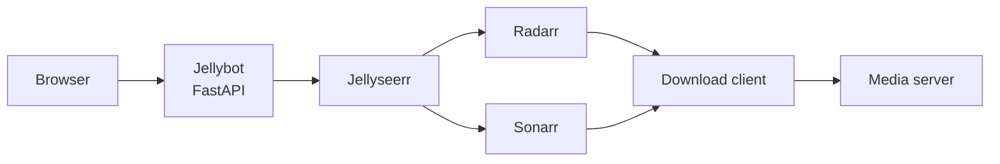

# Jellybot

> A simple, self-hosted chat interface for requesting movies through Jellyseerr.

Jellybot turns the usual media-request form into a short conversation. Search for a movie, choose the correct result, confirm the request, and let your existing Jellyseerr media pipeline handle the rest.

```text
You:      Get me The Matrix
Jellybot: I found these movies. Which one would you like?
You:      The first one
Jellybot: The Matrix (1999). Would you like me to request it?
You:      Yes
Jellybot: The Matrix (1999) has been requested successfully.
```

## Features

- Conversational movie search and request flow
- Natural selections such as `1`, `the first one`, or `the 1999 one`
- Confirmation before every request
- Separate conversation state for each browser session
- Server-side Jellyseerr authentication—the API key is never sent to the browser
- Friendly handling for missing results and connection failures
- Browser interface and compatibility CLI
- Docker deployment with a non-root container user
- Container health check and `GET /health` endpoint
- Unit tests with mocked Jellyseerr requests

Jellybot currently supports movie requests. TV and season selection are planned for a future release.

## How it works



Jellybot only searches and submits requests. Jellyseerr, Radarr, Sonarr, your download client, and your media server remain separate services. Existing notifications from those services continue to depend on their own notification configuration.

## Requirements

- A working Jellyseerr installation
- A Jellyseerr API key
- Docker with Docker Compose (recommended)

## Quick start with Docker

1. Clone the repository and enter the application directory:

   ```bash
   git clone <your-repository-url>
   cd JellySeer-Chatbot/jellybot
   ```

2. Create the local environment file:

   ```bash
   cp .env.example .env
   ```

3. Edit `.env` and add your Jellyseerr connection details:

   ```dotenv
   JELLYSEERR_URL=http://YOUR_JELLYSEERR_HOST:5055
   JELLYSEERR_API_KEY=YOUR_JELLYSEERR_API_KEY
   JELLYBOT_SESSION_SECRET=REPLACE_WITH_A_LONG_RANDOM_VALUE
   ```

   Generate a session secret with:

   ```bash
   python3 -c "import secrets; print(secrets.token_urlsafe(32))"
   ```

4. Build and start Jellybot:

   ```bash
   docker compose up -d --build
   ```

5. Open [http://localhost:9972](http://localhost:9972) in a browser.

Check the container and application health with:

```bash
docker compose ps
curl http://localhost:9972/health
```

Stop Jellybot with:

```bash
docker compose down
```

## Configuration

| Variable | Required | Description |
| --- | --- | --- |
| `JELLYSEERR_URL` | Yes | Base URL of the Jellyseerr server, without a trailing slash |
| `JELLYSEERR_API_KEY` | Yes | API key created in Jellyseerr |
| `JELLYBOT_SESSION_SECRET` | Recommended | Stable random value used to sign browser session cookies |

Never commit your real `.env` file or API key. Only `.env.example` with placeholder values should be stored in Git.

## Supported conversations

Start a search with phrases such as:

```text
Get me Interstellar
Find The Matrix
Download Dune
Request Dune Part Two
I want The Lord of the Rings
```

When several results are returned, select one with:

```text
1
the first one
second
the 2024 one
```

Confirm with `yes`, `yeah`, `go ahead`, or `do it`. Use `cancel`, `no`, or `never mind` to stop the current request.

## Project structure

```text
JellySeer-Chatbot/
├── jellybot/
│   ├── app/
│   │   ├── static/          # Browser JavaScript and styles
│   │   ├── templates/       # Chat page
│   │   ├── chat.py          # Conversation flow and selection parsing
│   │   ├── cli.py           # Compatibility command-line interface
│   │   ├── config.py        # Environment configuration
│   │   ├── jellyseerr.py    # Server-side Jellyseerr API client
│   │   ├── main.py          # FastAPI application
│   │   └── requirements.txt
│   ├── tests/
│   ├── compose.yaml
│   └── Dockerfile
├── Jenkinsfile
└── README.md
```

## Local development

From the `jellybot` directory:

```bash
python3 -m venv .venv
source .venv/bin/activate
python -m pip install -r app/requirements.txt
uvicorn app.main:app --reload --port 8000
```

The development server is available at [http://localhost:8000](http://localhost:8000).

Run the original command-line flow with:

```bash
python3 app/app.py "The Matrix"
```

## Tests and linting

Jellyseerr calls are mocked during tests, so the test suite does not submit real media requests.

```bash
pytest
ruff check .
```

## API endpoints

| Method | Path | Purpose |
| --- | --- | --- |
| `GET` | `/` | Browser chat interface |
| `POST` | `/api/chat` | Process a chat message |
| `GET` | `/health` | Report application and Jellyseerr connectivity |

## Reverse proxy

Jellybot can sit behind a reverse proxy such as Nginx Proxy Manager. Point the proxy host to the Docker host on port `9972`. For an internet-accessible installation, place Jellybot behind authentication such as Authentik or another access-control layer.

## Troubleshooting

### Jellybot cannot reach Jellyseerr

- Confirm `JELLYSEERR_URL` is reachable from the Docker host.
- Confirm the API key is current and has no surrounding quotes or spaces.
- Remember that `localhost` inside the Jellybot container refers to the container itself, not another machine.
- Review application output with `docker compose logs -f jellybot`.

### The browser cannot open Jellybot

- Confirm the container is running with `docker compose ps`.
- Open port `9972` on the Docker host, not Jellyseerr's port.
- When using a reverse proxy, confirm its hostname resolves to the reverse-proxy server and that its upstream points to the Jellybot host on port `9972`.

## Security

- All Jellyseerr communication happens on the server.
- The browser never receives the Jellyseerr API key.
- Requests use a configured timeout and require confirmation.
- The container runs as a non-root user.
- Keep `.env` private and rotate any credential that was previously committed.
- Use authentication and rate limiting when exposing Jellybot outside a trusted network.

## Contributing

Issues and pull requests are welcome. Please run `pytest` and `ruff check .` before submitting changes.

## License

Jellybot is available under the [MIT License](LICENSE).

Copyright © 2026 Yusuf Sahibzada.
