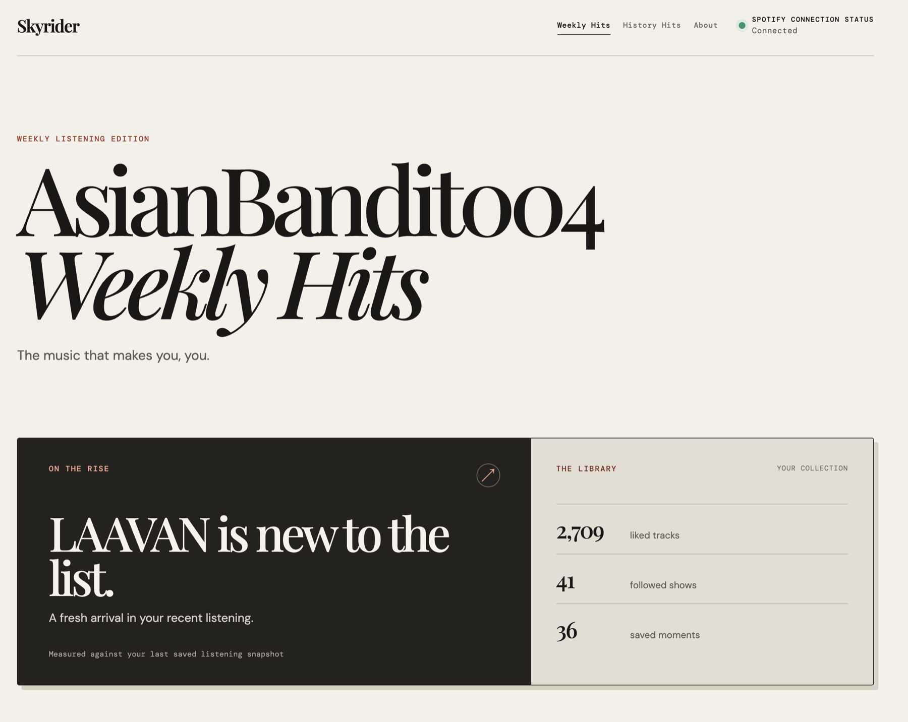
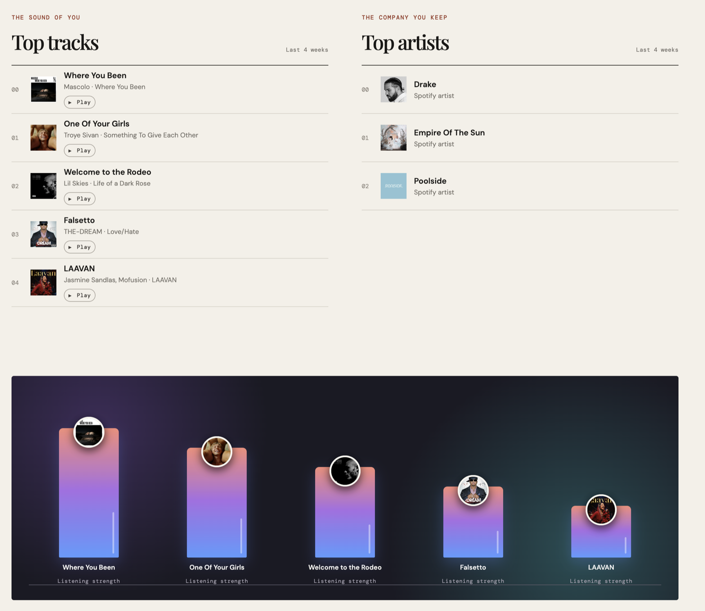
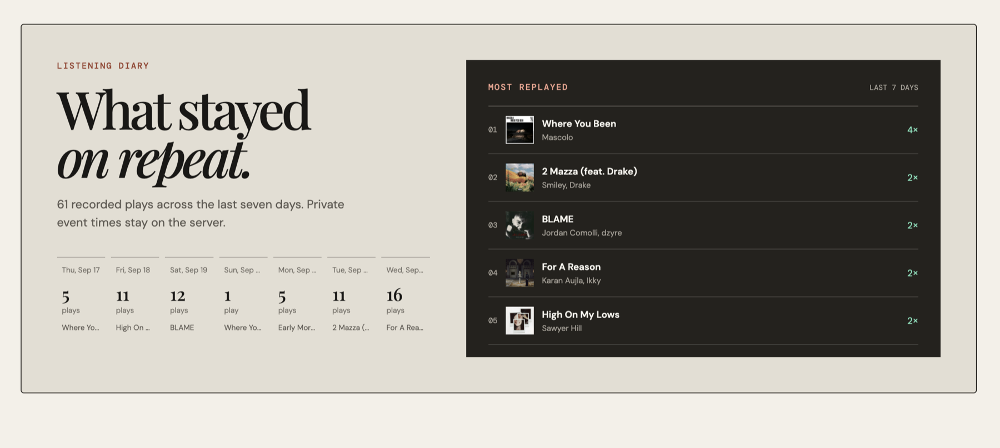
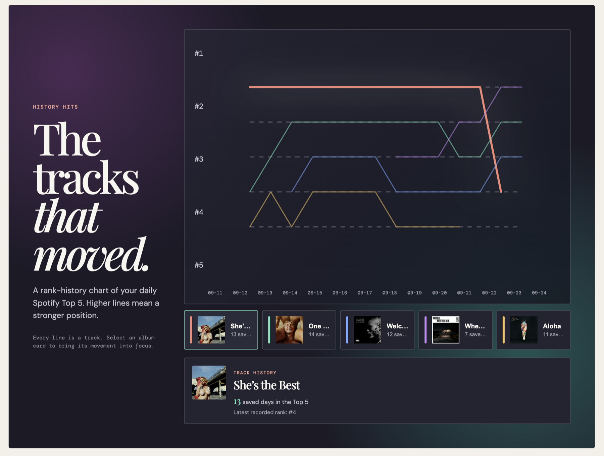

<div align="center">

# 🎧 Skyrider

### Your listening history, turned into a living visual archive.

**Weekly favorites. Daily replays. Long-term movement. One private-first Spotify dashboard.**


</div>



Skyrider is a personal Spotify listening dashboard built to answer a more interesting question than *"What am I playing right now?"*

It asks: **Which tracks keep returning, which artists are defining the moment, and how is my taste changing over time?**

The result is part dashboard, part listening diary, and part visual time capsule.

## ✨ What Skyrider turns into

- **Weekly Hits** — Spotify's rolling Top Tracks and Top Artists presented as an editorial front page.
- **Listening Strength** — a colorful rank-based view of the five tracks leading the current snapshot.
- **Listening Diary** — seven days of collected plays with a private, server-side event history.
- **Most Replayed** — the tracks that genuinely came back during the collection window.
- **History Hits** — a line chart showing how songs rise, fall, disappear, and return across saved snapshots.
- **Listen here** — official Spotify embeds let visitors play a selected track using their own Spotify session.

## 🎵 The current sound

Album artwork stays at the center of the experience. The dashboard combines current favorites, artist context, and a vibrant visual ranking without pretending Spotify provides exact lifetime play counts.



## 📓 A diary that builds itself

The recently-played collector runs every two hours. Skyrider turns those private events into daily totals and replay rankings while keeping exact event timestamps on the server.



## 📈 Taste in motion

Daily Top 5 snapshots become a rank-history chart. Each colored line belongs to a track, while album cards make it easy to follow one song's movement through the archive.



## 🧠 How it works

```text
Browser -> HTTPS reverse proxy -> Node on 127.0.0.1:3333 -> SQLite
                                  |
                                  +-> Spotify Web API

systemd timers -> refresh scripts -> encrypted token + snapshots in SQLite
```

The browser receives presentation-safe aggregates. Spotify credentials, the encrypted refresh token, raw listening events, and the database remain on the application host.

## 🧰 Built with

- TypeScript, semantic HTML, and custom CSS
- Vite production builds
- Node.js using the built-in HTTP and SQLite modules
- Native SVG charts—no heavyweight chart dependency
- Vitest unit coverage and Playwright browser tests
- Apache reverse proxy and systemd supervision
- Jenkins validation and deployment
- Spotify Web API and official Spotify embeds

## 🚀 Run it locally

Node.js 24.5 or newer is required because the server uses `node:sqlite`.

```bash
npm ci
npm run dev
```

Copy `.env.example` to a local environment file outside source control and provide development-only values. Never commit a populated environment file or SQLite database.

## ✅ Validate the project

```bash
npm run lint
npm run test
npm run build
npm run test:e2e
```

The current public-safe snapshot passes lint, 10 unit tests, TypeScript validation, a production build, and 4 Playwright tests.

## 🔐 Read-only Spotify access

Skyrider requests only:

- `user-read-private`
- `user-library-read`
- `user-top-read`
- `user-read-recently-played`

It does not request playlist modification, library modification, account control, or Spotify streaming scopes. Playback uses Spotify's official public embed and the visitor's own Spotify session.

## 🗂️ Project guide

- [Architecture](docs/ARCHITECTURE.md)
- [API](docs/API.md)
- [Data storage](docs/DATA-STORAGE.md)
- [Deployment](docs/DEPLOYMENT.md)
- [Operations](docs/OPERATIONS.md)
- [Troubleshooting](docs/TROUBLESHOOTING.md)
- [Security policy](SECURITY.md)

Public-safe Apache and systemd examples live under `ops/`. `Jenkinsfile.example` demonstrates the CI/CD flow without exposing production hostnames, paths, host keys, or credentials.

---

<div align="center">

**Skyrider** — the music that makes you, you.

</div>
